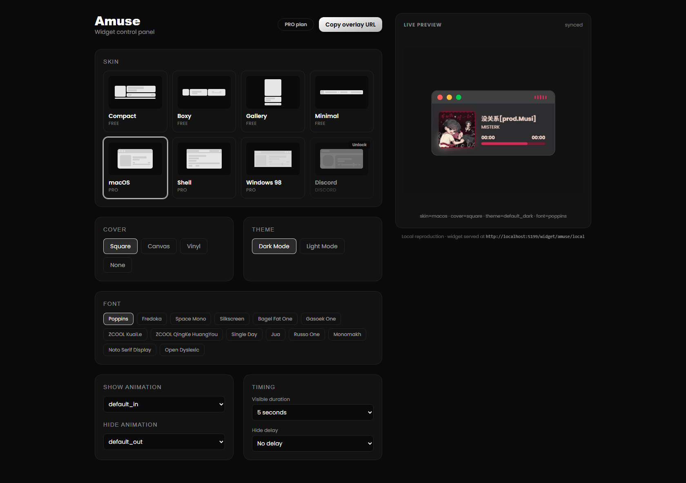
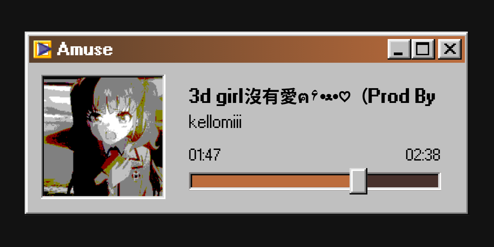

# Amuse

[English](en.md) · [简体中文](zh.md) · [日本語](ja.md) · [한국어](ko.md) · [← 戻る](../README.md)





## 使い方

```bash
pnpm install

pnpm mock     # バックエンド -> http://localhost:8787
pnpm widget   # ウィジェット -> http://localhost:5199/widget/amuse/local
pnpm panel    # パネル -> http://localhost:5174
```

- コントロールパネル: <http://localhost:5174>
- ウィジェット: <http://localhost:5199/widget/amuse/local>
